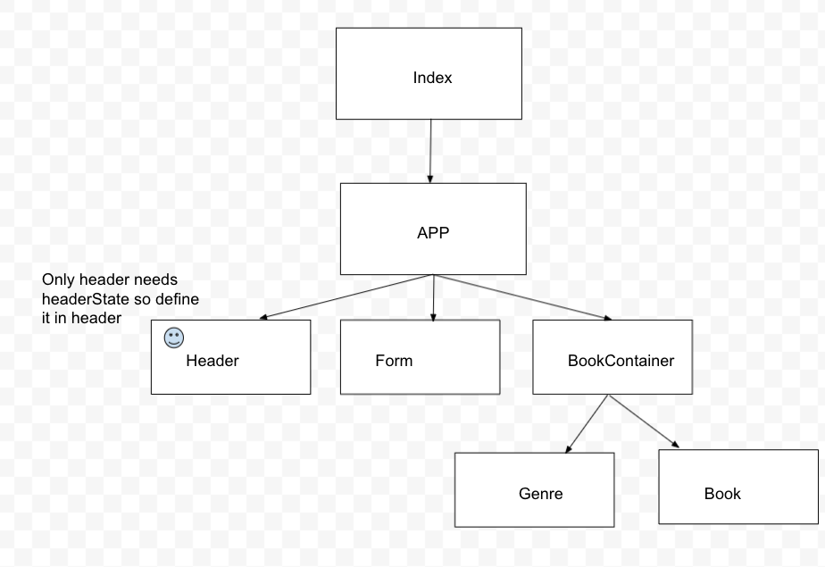

# State & Events
## SWBAT
- [] Create Events in react 
- [] Pass build in even listeners callbacks
- [] Creating state using useState
- [] Give state a default value
- [] Updating State using a set function from useState
- [] Use events to pass data UP to parent components

### What is state?
State is data controlled in our components that can be dynamic.
While it doesn't persist without a database, we can use this state to change what's being render on our browser. 

### Where should state be defined?
To keep the code dry, so state should be defined where it  will reach every component that needs that state.   

For example if only one component needs some state, it should be defined in that component.  



However if several components share state, state should be defined in the first common ancestor of those components. 


### UseState
We hold state using the useState method from react

```
import {useState} from 'react'
``` 

useState returns 2 things, a state object and a state setter/updater. When we useState we destructor these. We can set a default value by passing useState an argument. Here the default value to cats will rose.

Cats can now be used to render rose to our browser!

```
const [cats, setCats] = useState('rose')

return(
    <div>cats</div>
)
```

### Setting State
The setter we deconstructed from useState will be used to update the state value. 

onClick will call setCats and update it from rose to bubbles. 

once setCat is called our component will be rerendered with the new state rendered to the browser 

```
const [cats, setCats] = useState('rose')

return(
    <div onClick={() => setCats('bubbles')}>cats</div>
)
```


