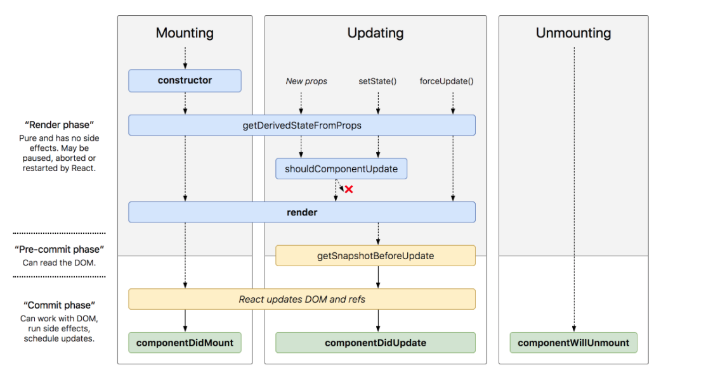

# Forms
## SWBAT
- [] Understand the stages of the component lifecycle
- [] Implement the useEffect hook
- [] Implement a GET request in react

## json-server
We will be using json-server again!
```
json-server --watch --port4000 db.json
```

## React Component Lifecycle

- Pre-mounting (when state is initialized)
- Mounting (component initially created and is mounted onto the DOM)
- Updating (changes in state or props and the page is re-rendered)
- Unmounting (component is deleted off the page)

## Side Effects
`an operation, function or expression is said to have a side effect if it modifies some state variable value(s) outside its local environment, that is to say has an observable effect besides returning a value (the main effect) to the invoker of the operation. — Wikipedia on Side Effects`

Whenever we call a function and it has an effect on something outside of itself it's considered having a side effect. Sometimes these are unintentional and can cause issues, but other times they are necessary. 
- Fetch some data from an API when a component loads
- Start or stop a timer
- Manually change the DOM
- Subscribe to a chat service

## useEffect 
The useEffect hook is a function for managing these side effects. 

`By using this Hook, you tell React that your component needs to do something after render. React will remember the function you passed (we'll refer to it as our "effect"), and call it later after performing the DOM updates. — React docs on the useEffect hook`

## Calling a sideEffect when the component mounts
By default, useEffect will run our side effect function every time the component re-renders.

Which can cause a problem if you are setting state inside use effect.

render -> useEffect -> setState -> re-render -> useEffect -> endless loop

React lets us prevent this with the `dependencies array`, adding this array as a second argument will allow useEffect to run once when the component renders for the first time. 

We can use this hook much like we used the loading of the DOM, to trigger http requests. 

```
  useEffect(() => {
    fetch("http://books")
      .then(res => res.json())
      .then(data => {
        // setting state in the useEffect callback
        setBooks(data);
      });
  },[]);

```